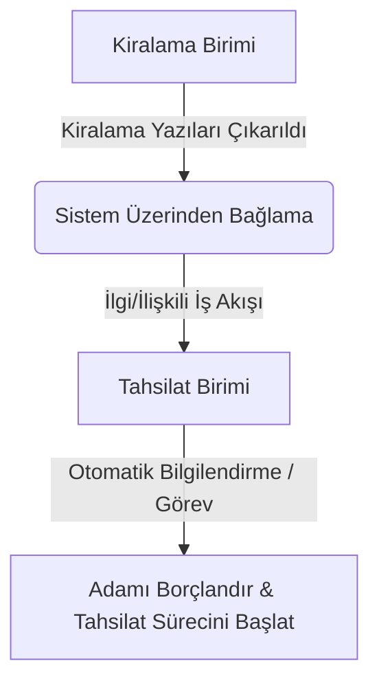

# FlowDesk — Kurumsal İş Takip & Birimler Arası Süreç Yönetim Sistemi

> [!NOTE]
> Bu proje [dt-desktop-app](https://github.com/ilyasbozdemir/dt-desktop-app) deposundan klonlanarak FlowDesk kurumsal iş takip sistemine dönüştürülmektedir.

Bu doküman, uygulamanın genel amacını, üst klasör (parent folder) yapısını,
planlanan sunucu-istemci (server-client) mimarisini ve birimler arası iş akış
mantığını açıklamaktadır.

> [!IMPORTANT]
> **Bu aşamada sisteme kesinlikle `commit` atılmamalıdır!** Boş/placeholder
> ekranlar elenecek ve aşağıda belirtilen temel mantık doğrultusunda geliştirme
> yapılacaktır.

---

## 📂 Üst (Parent) Klasör Adı ve Yapısı

Sistemin çalıştığı ana çalışma dizini: `flowdesk` (Dizin yolu:
`d:\Github\ilyas-bozdemir\flowdesk`)

---

## 🎯 Uygulama Amacı ve Genel Kurum İş Takip Mantığı

Bu sistemin temel amacı, **bir kurum içerisindeki tüm birimlerin
(departmanların) iş süreçlerini uçtan uca takip etmesi, koordine etmesi ve
birimler arası görev paslaşmasını yönetmesidir.**

Sistem statik veya bağımsız bir iş listesi olmaktan öte, **birimler arası
ardışık ve entegre iş akışları (workflow)** üzerine kurulmuştur.

### 🔄 Birimler Arası İş Akışı Senaryosu (Örnek)

Bir birim kendisiyle ilgili bir süreci veya yazışmayı tamamladığında, sistem bu
işin çıktısını otomatik ya da manuel olarak **ilgi/ilişkili birime** bağlar.



- **Örnek Senaryo:**
  1. **Emlak/Kiralama Birimi**, bir taşınmaz kiralamasına dair resmi yazıları ve
     onayları sisteme girer ve işi tamamlar.
  2. Sistem, bu işin sonucunu otomatik olarak **Gelir/Tahsilat Birimi**ne
     bağlar.
  3. **Tahsilat Birimi**nin ekranına _"Kiralama Birimi kiralama yazılarını
     çıkardı. İlgili kişinin borçlandırma ve tahsilat işlemlerini başlatın."_
     şeklinde bir görev ve veri akışı düşer. Böylece kurum içinde hiçbir iş
     gözden kaçmaz ve kopukluk yaşanmaz.

---

## 🔌 Sunucu-İstemci (Server-Client) Mimarisi ve Veri Akışı

Mevcut masaüstü (Electron/SQLite) yapısına ek olarak, sistem **Ayrı bir Node.js
Sunucusu (Backend)** ve **İstemci (Client)** mimarisine taşınacaktır veya
entegre edilecektir:

1. **Ayrı Node.js Sunucusu (Backend Server):**
   - Express.js veya NestJS tabanlı REST API / WebSocket sunucusu.
   - Merkezi veritabanı bağlantısı (PostgreSQL/MySQL veya merkezi SQLite).
   - Birimler arası anlık bildirimler, görev atamaları ve veri senkronizasyonu.

2. **Masaüstü/Web İstemci (Client):**
   - Electron ve React (TSX) tabanlı frontend.
   - Sunucu API'leri ile haberleşen, çevrimdışı (offline-first) çalışabilen,
     `.dtm` dosyalarını sunucuya senkronize edebilen veya doğrudan sunucu veri
     tabanını kullanan bir yapı.
   - Gelişmiş yetkilendirme ve rol tanımları (Fen İşleri, Mali Hizmetler,
     Tahsilat vb. için farklı görünüm ve yetkiler).

---

## 🛠️ Düzenlenecek ve Temizlenecek Alanlar

- **Boş Ekranların Silinmesi:** İş akışına doğrudan katkısı olmayan, placeholder
  durumundaki veya kullanılmayan alt ekranlar projeden temizlenecektir.
- **Birim Tanımlamalarının Ayrıştırılması:** Her birimin kendine has dinamik
  yapısı (Fen İşleri, Yazı İşleri, Mali Hizmetler, Zabıta, Tahsilat vb.)
  tanımlanacak ve işlerin bu birimler arasında paslanması için gerekli veri
  yapıları kurulacaktır.
- **Sunucu Dosya Uzantıları & Entegrasyon:** Sistem genelinde veri paketleme
  için `.dtm` ve `.dte` gibi özel dosya formatları desteklenirken,
  sunucu-istemci modelinde JSON/Binary API entegrasyonları kullanılacaktır.

<p align="center">
  
</p>

<p align="center">
  <a href="https://github.com/ilyasbozdemir/dt-desktop-app/actions"></a>
  <a href="https://github.com/ilyasbozdemir/dt-desktop-app/releases/latest"></a>
  <a href="https://github.com/ilyasbozdemir/dt-desktop-app/releases"></a>
</p>

**4734 Sayılı Kamu İhale Kanunu Madde 22 kapsamında doğrudan temin yoluyla
yapılan alımları yönetmek için geliştirilmiş masaüstü uygulama.**

---

## Hakkında

Doğrudan Temin Programı, internet bağlantısı gerektirmeyen, tamamen **çevrimdışı
(offline)** çalışan bir masaüstü uygulamasıdır. Verileriniz yalnızca kendi
bilgisayarınızda saklanır; herhangi bir sunucuya veya bulut sistemine
gönderilmez.

Uygulama, tüm verilerini `.dtm` uzantılı dosyalarda saklar. Bu dosya formatı,
tıpkı `.docx`, `.xlsx` veya `.pptx` gibi uygulamaya özgü bir yapıya sahiptir;
içinde SQLite veritabanı ve ilgili meta veriler yer alır. Dosyalarınızı
yedekleyebilir, taşıyabilir ve paylaşabilirsiniz.

---

## Özellikler

- **Mevzuata tam uygunluk** — 4734 Sayılı Kamu İhale Kanunu Madde 22 ve Kamu
  İhale Kurumu standartları eksiksiz karşılanmaktadır; mevzuat değişikliklerinde
  güncelleme merkezi iş akışına doğrudan yansır
- **Tek girdi, sonsuz kullanım** — Kurum bilgilerinizi, mal ve hizmet
  kalemlerinizi bir kez tanımlayın; sonraki her alımda listeden seçerek
  saniyeler içinde dosya oluşturun
- **Dinamik şablon yönetimi** — Belgelerinizi uygulama içinden düzenleyebilir,
  anlık önizleyebilir ve tek tıkla `.xlsx` ya da `.docx` formatında dışa
  aktarabilirsiniz
- **DYS uyumlu çıktı** — Tüm belgeler `.UDF` formatında da dışa aktarılabilir;
  Doküman Yönetim Sistemi entegrasyonu ek adım gerektirmez
- **Adım adım rehberli iş akışı** — Her süreç aşaması yönlendirmeli ekranlarla
  ilerler; eksik ya da hatalı bilgi girilmesi sistem tarafından engellenir
- **Sınırsız dosya ve kalem** — İstediğiniz kadar doğrudan temin dosyası
  açabilir, yüzlerce mal ve hizmet kalemini kütüphanede saklayabilirsiniz
- **Erişilebilir arayüz** — Tüm boyutlar `rem` birimiyle tanımlanmıştır; sistem
  genelinde yazı boyutunu değiştirmeniz arayüzün tamamına anında yansır, WCAG
  erişilebilirlik standartları gözetilmiştir
- **Tamamen çevrimdışı** — İnternet bağlantısı gerekmez, verileriniz yalnızca
  sizin bilgisayarınızda durur
- **Hızlı ve dayanıklı depolama** — SQLite tabanlı yerel veritabanı; büyük veri
  setlerinde bile yanıt süresi etkilenmez

---

## Dosya Formatı

`.dtm` dosyaları ZIP tabanlı bir yapıya sahiptir. İçeriği:

```
dosya.dtm
├── database.sqlite    ← Tüm veriler
├── meta.json          ← Sürüm ve şema bilgisi
└── attachments/       ← Varsa ek dosyalar
```

Bu yapı sayesinde dosyalarınız hem taşınabilir hem de versiyon uyumluluğu
açısından yönetilebilirdir.

---

## Kurulum

```bash
# Bağımlılıkları yükle
pnpm install

# Geliştirme modunda çalıştır
pnpm run dev

# Üretim için derle (Windows)
pnpm run build:win

# Linux veya Mac için derle (İsteğe bağlı)
pnpm run build:linux
pnpm run build:mac
```

---

## Teknolojiler

- [Electron.js](https://www.electronjs.org/) — Masaüstü uygulama çatısı
- [Radix UI](https://www.radix-ui.com/) — Erişilebilirlik odaklı, headless
  bileşen kütüphanesi
- [Tailwind CSS](https://tailwindcss.com/) — `rem` tabanlı, responsive
  utility-first stil sistemi
- [SQLite](https://www.sqlite.org/) /
  [better-sqlite3](https://github.com/WiseLibs/better-sqlite3) — Yerel
  veritabanı
- [Express.js](https://expressjs.com/) — Dahili API katmanı
- [node-windows](https://github.com/coreybutler/node-windows) — Windows servis
  entegrasyonu

---

## Lisans

Bu proje [GNU Affero General Public License v3.0](./LICENSE) lisansı ile
lisanslanmıştır.

```
dt-desktop-app - Doğrudan Temin Masaüstü Yönetim uygulaması
Copyright (C) 2026  İlyas Bozdemir
```
